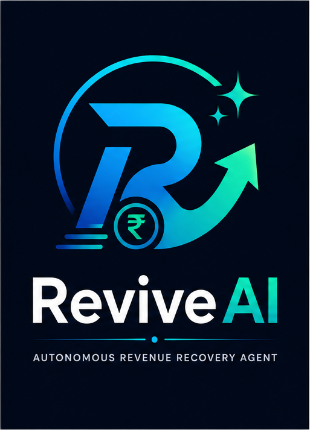
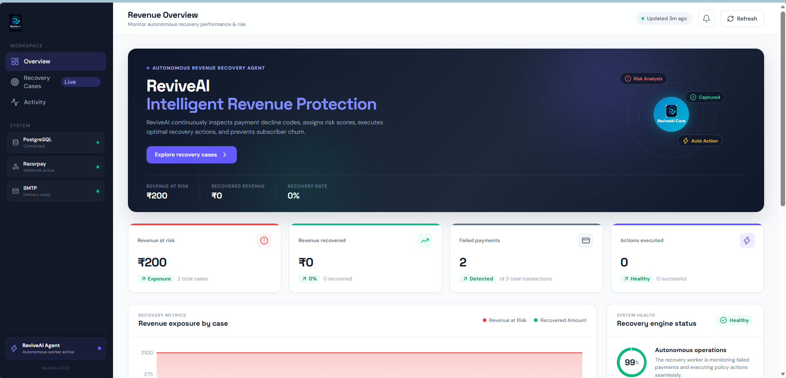
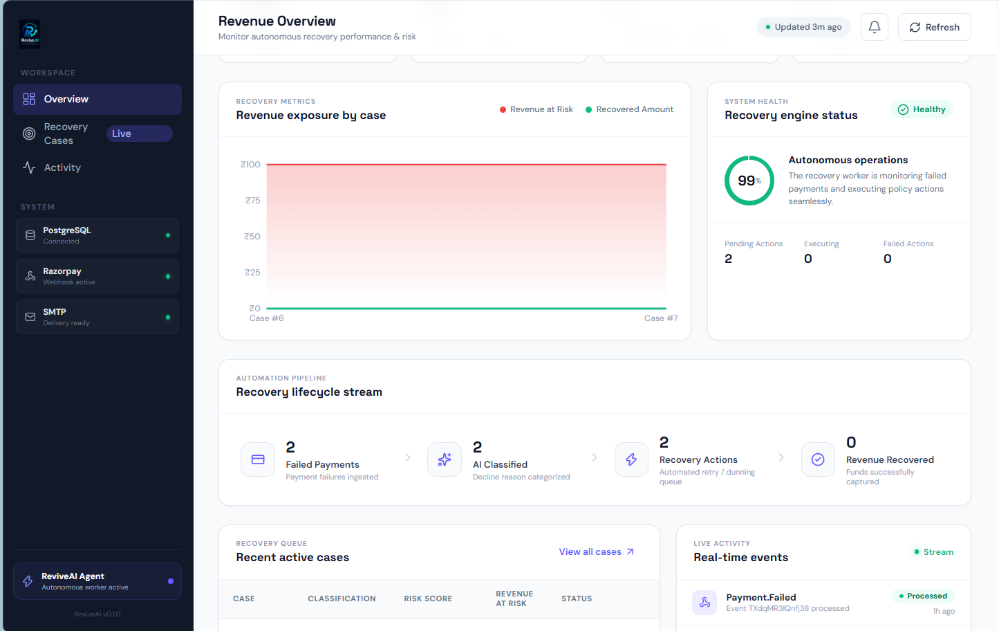
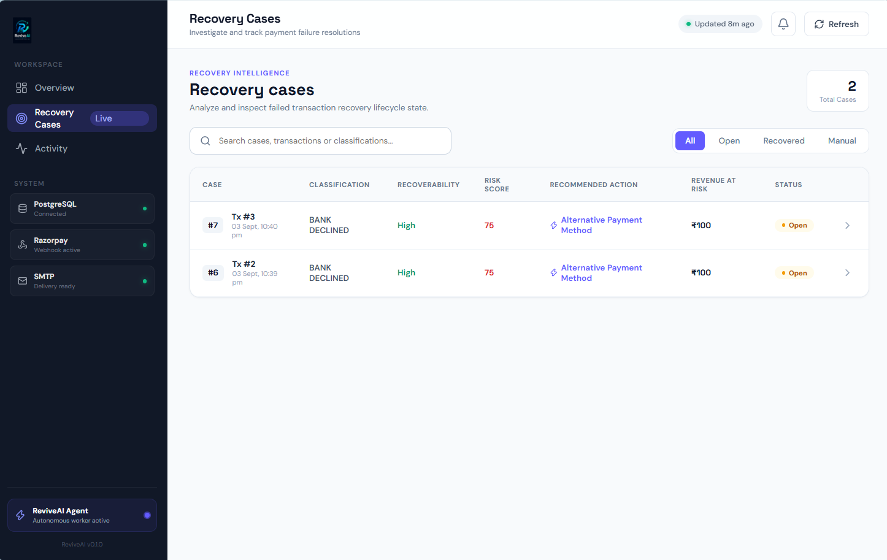
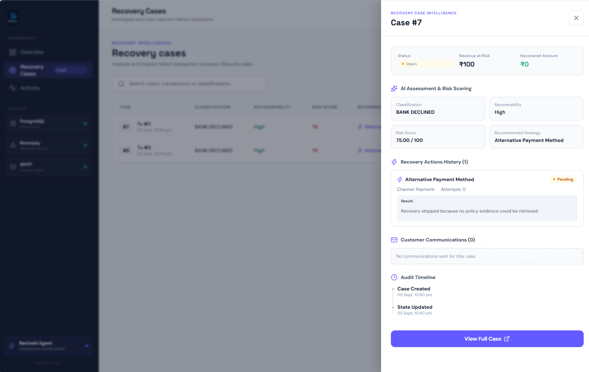
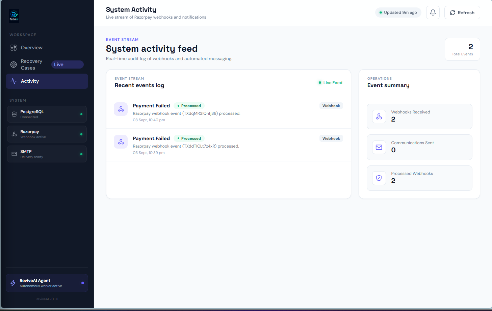
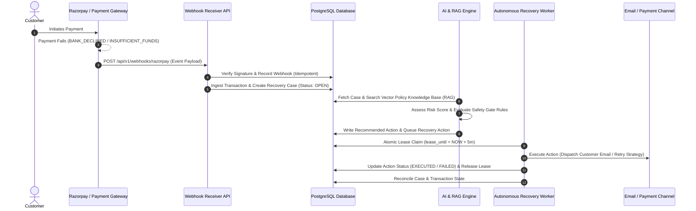
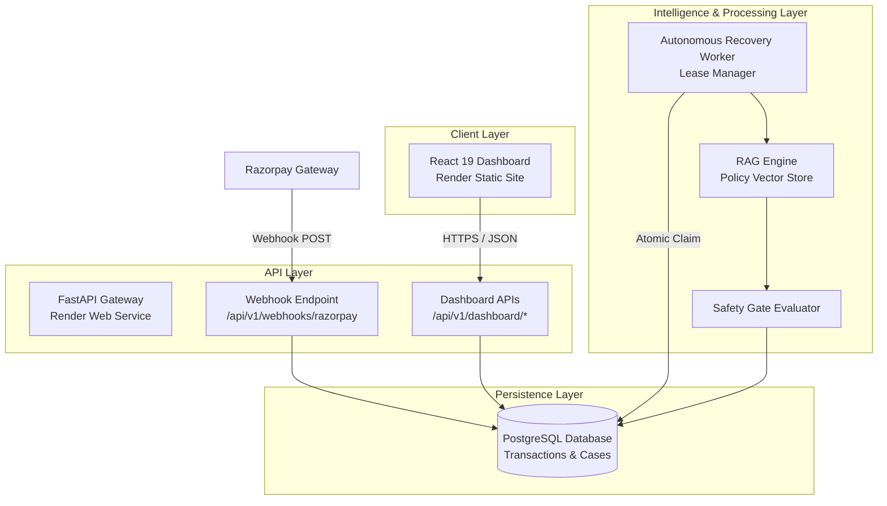
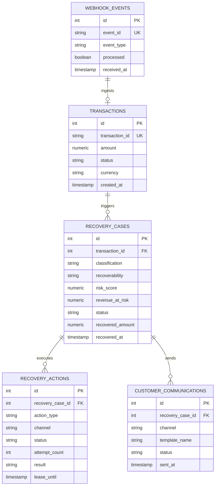

<div align="center">



# ReviveAI
### Autonomous Revenue Recovery Agent

**An intelligent, event-driven revenue recovery system that detects payment failures, classifies decline reasons, evaluates risk & recoverability, retrieves policy evidence via RAG, enforces financial safety gates, and executes autonomous dunning workflows.**

[](https://adaptive-revenue-recovery-dashboard.onrender.com)
[](https://adaptive-revenue-recovery-api.onrender.com)
[](https://adaptive-revenue-recovery-dashboard.onrender.com)
[](https://adaptive-revenue-recovery-api.onrender.com)
[](LICENSE)

</div>

---

## Product Overview

**ReviveAI** is an autonomous, event-driven revenue recovery engine engineered to mitigate involuntary subscription churn caused by payment decline failures (e.g., insufficient funds, bank declines, expired cards, network timeouts). 

Unlike conventional dashboards or simple CRUD dunning scripts, ReviveAI operates as an **autonomous agentic workflow**:
1. Ingests payment failure webhooks in real-time.
2. Categorizes decline codes and evaluates risk and recoverability scores.
3. Performs Retrieval-Augmented Generation (RAG) against business policies and payment guidelines.
4. Enforces strict, deterministic financial safety gates to prevent unauthorized or risky actions.
5. Claims and leases recovery tasks atomically to execute automated dunning/retry workflows.
6. Reconciles state across payment providers, notification systems, and audit logs.

---

## Why ReviveAI?

Involuntary churn accounts for up to **40% of overall subscription churn**. Standard payment retry loops are rigid, uncoordinated, and often result in repeated declined charges that frustrate customers or trigger bank fraud flags.

ReviveAI solves this with:
- **Intelligent Decline Classification**: Differentiates between soft declines (retryable) and hard declines (requiring customer intervention).
- **Context-Aware Policy RAG**: Grounds decision-making in specific subscription terms, grace periods, and card brand rules.
- **Financial Safety-First Architecture**: Bounds AI recommendations with deterministic safety gates, idempotent claim locks, and worker leases.
- **End-to-End Auditability**: Tracks every webhook, evaluation, claim, action attempt, and customer notification.

---

## Core Capabilities

- ⚡ **Real-Time Webhook Ingestion**: Idempotent signature verification for payment failure events (Razorpay integration).
- 🧠 **AI & RAG Decision Engine**: Combines LLM analysis with vectorized policy retrieval to formulate optimal recovery strategies.
- 🛡️ **Bounded Safety Controls**: Enforces hard boundaries (e.g., maximum retry counts, grace period limits) preventing unrestricted AI actions.
- 🔄 **Atomic Worker Leasing**: Distributed worker architecture with atomic database leases preventing duplicate action execution.
- 📊 **Real-Time Operations Dashboard**: Responsive React 19 single-page interface with dynamic Recharts analytics and live case drawers.
- ✉️ **Multi-Channel Dunning Notifications**: Automated email notifications dispatched via SMTP integration.

---

## Product Screenshots

### 1. Revenue Overview Dashboard

*ReviveAI Revenue Overview — real-time operational view of revenue exposure, recovery performance, system integrations, and autonomous agent status.*

---

### 2. Autonomous Recovery Lifecycle

*Autonomous Recovery Lifecycle — visualizes the progression from failed payment ingestion through AI classification and recovery actions to successful revenue recovery.*

> [!NOTE]
> *The current production snapshot reflects verified environment metrics (Revenue at Risk: ₹200, Recovered Revenue: ₹0) during validation.*

---

### 3. Active Recovery Case Queue

*Recovery Case Queue — active recovery cases with failure classification, risk scoring, revenue exposure, and current recovery status.*

---

### 4. Case Intelligence & Audit Drawer

*Recovery Case Intelligence — detailed case-level view combining payment failure classification, recoverability, risk assessment, recommended recovery action, and execution state.*

---

### 5. System Activity & Webhook Feed

*Operational Activity Feed — provides visibility into webhook processing, recovery actions, communications, and other system activity.*

---

## End-to-End Recovery Workflow



---

## System Architecture

ReviveAI employs a decoupled, microservices-ready architecture:



---

## AI + RAG + Safety Architecture

ReviveAI deliberately separates reasoning from execution to guarantee financial safety:

1. **Policy RAG Retrieval**: When a payment failure is ingested, ReviveAI searches embedded policy documents (e.g., dunning rules, cancellation terms, bank retry guidelines).
2. **AI Risk Assessment**: The AI engine evaluates decline codes, customer history, and policy context to calculate a **Risk Score** (0–100) and **Recoverability Category** (`high`, `medium`, `low`).
3. **Deterministic Safety Gates**: AI outputs are passed through strict code-level guardrails:
   - Maximum attempt limits enforced per strategy.
   - Restrict action types based on hard declines (e.g., never auto-retry a stolen card decline).
   - Require explicit grace period windows prior to account suspension.
4. **Action Scoping**: Prevents hallucinated or unauthorized financial mutations by restricting execution exclusively to pre-approved action types (`alternative_payment_method`, `smart_retry`, `dunning_email`, `manual_review`).

---

## Recovery Intelligence

ReviveAI categorizes transaction failure reasons into structured classifications:

| Failure Classification | Recoverability | Default Strategy | Safety Gate Rule |
| :--- | :--- | :--- | :--- |
| `INSUFFICIENT_FUNDS` | High | Smart Retry + Reminder | Max 3 retries within 7-day window |
| `BANK_DECLINED` | Medium | Alt Payment Request | Require customer verification |
| `EXPIRED_CARD` | High | Dunning Card Update Link | Immediate notification, no retries |
| `FRAUD_SUSPECTED` | Low | Manual Review Flag | Zero automated retries allowed |

---

## Financial Safety & Reliability

To handle distributed financial operations safely, ReviveAI enforces strict reliability primitives:

- **Idempotent Ingestion**: Webhooks check `event_id` unique constraints to ensure identical payment failure webhooks are never processed twice.
- **Atomic Task Claiming**: Workers acquire locks using PostgreSQL atomic `UPDATE ... WHERE lease_until IS NULL` queries to eliminate race conditions between concurrent worker threads.
- **Worker Leases**: Tasks are assigned a 5-minute lease time limit. If a worker crashes mid-execution, the lease expires and the task automatically returns to the queue.
- **Attempt Tracking & Exponential Backoff**: Each recovery action tracks `attempt_count` and `last_attempt_at`, preventing notification spam or rate-limit violations.
- **Immutable Audit Trail**: All status changes, action attempt payloads, and execution results are logged permanently.

---

## Autonomous Worker

The recovery background process executes discrete cycles to resolve open recovery cases:

### Worker Execution Cycle:
1. **Discovery**: Queries pending actions scheduled for execution (`status = 'pending'`).
2. **Claiming**: Atomically claims batch tasks with a lease timestamp.
3. **Execution**: Evaluates policy evidence, dispatches dunning channels (e.g., SMTP email), or records stopping conditions.
4. **Release & Audit**: Updates the action status (`executed`, `failed`) and updates the parent recovery case state.

#### Dry-Run Mode Validation:
During production verification, the worker was tested in **DRY-RUN** mode:
```text
MODE: DRY-RUN
Batch Size: 10
Cycles Executed: 1
Found: 2 pending actions
Claimed: 2 actions
Processed: 2 actions
Failed: 0 actions
```
*Dry-run mode validates worker discovery, atomic claiming, and task execution logic without producing financial or email side-effects.*

---

## Dashboard & Operational Visibility

The React 19 frontend provides an intuitive operations command center:

- **Revenue Overview**: High-level KPIs showing Revenue at Risk, Recovered Revenue, Recovery Rate, and active engine health.
- **Performance Visualizations**: Dynamic Recharts area chart mapping financial exposure across cases.
- **Automation Pipeline**: 4-stage visual funnel detailing progress from failure ingestion to revenue capture.
- **Recovery Queue Table**: Sortable and filterable case list with color-coded risk bars, decline classifications, and quick navigation.
- **Case Intelligence Slide-Over**: Deep-dive side panel fetching `/api/v1/dashboard/cases/{case_id}`, showing AI assessments, execution results (e.g., *"Recovery stopped because no policy evidence could be retrieved"*), and timeline events.
- **Live Activity Stream**: Combined feed of Razorpay webhooks and customer communication dispatches.

---

## API Reference

The FastAPI backend exposes read-only dashboard endpoints and webhook ingestion:

| Method | Endpoint | Description | Auth Required |
| :--- | :--- | :--- | :--- |
| `GET` | `/health` | System health check (Database connectivity & status) | None |
| `GET` | `/api/v1/dashboard/overview` | Aggregated dashboard KPIs, transaction & recovery metrics | None |
| `GET` | `/api/v1/dashboard/summary` | Executive summary of recovery status counts | None |
| `GET` | `/api/v1/dashboard/cases` | Paginated recovery case list (supports `limit`, `offset`) | None |
| `GET` | `/api/v1/dashboard/cases/{case_id}` | Detailed case inspection (case info, actions, communications) | None |
| `GET` | `/api/v1/dashboard/webhooks` | Recent ingested webhook events log | None |
| `GET` | `/api/v1/dashboard/communications` | Logged customer communications stream | None |
| `POST` | `/api/v1/webhooks/razorpay` | Razorpay payment failure webhook receiver | Webhook Signature |

---

## Database & Data Model

ReviveAI uses PostgreSQL managed via Alembic migrations.



---

## Project Structure

```text
adaptive-revenue-recovery-agent/
├── assets/
│   ├── branding/
│   │   ├── reviveai-icon.png
│   │   ├── reviveai-logo-light.png
│   │   └── reviveai-logo.png
│   └── screenshots/
│       ├── activity.png
│       ├── case-details.png
│       ├── overview.png
│       ├── recovery-cases.png
│       └── recovery-lifecycle.png
├── backend/
│   ├── alembic/                # Database migration scripts
│   ├── app/
│   │   ├── api/                # FastAPI router & endpoints
│   │   ├── core/               # App configuration & DB session
│   │   ├── models/             # SQLAlchemy ORM database models
│   │   ├── schemas/            # Pydantic data validation schemas
│   │   ├── services/           # AI, RAG, Webhook & Worker services
│   │   └── main.py             # FastAPI entry point
│   └── tests/                  # Pytest test suite
├── frontend/
│   ├── public/
│   │   └── branding/           # Vite runtime branding assets
│   ├── src/
│   │   ├── components/         # Modular React 19 UI components
│   │   ├── api.js              # API fetch client & helpers
│   │   ├── App.jsx             # Main dashboard container
│   │   ├── App.css             # SaaS design system styles
│   │   └── main.jsx            # React root mounting
│   ├── index.html              # HTML entry point with ReviveAI favicon
│   ├── package.json
│   └── vite.config.js
├── policies/                   # Knowledge base policy markdown files
├── alembic.ini
├── docker-compose.yml
└── requirements.txt
```

---

## Local Development

### Prerequisites
- Python 3.11+
- Node.js 18+
- PostgreSQL database

### 1. Backend Setup
```bash
# Navigate to workspace root & activate virtual environment
python -m venv .venv
source .venv/bin/activate  # On Windows: .venv\Scripts\activate

# Install dependencies
pip install -r requirements.txt

# Run database migrations
cd backend
alembic upgrade head

# Start FastAPI dev server
uvicorn app.main:app --reload --port 8000
```

### 2. Frontend Setup
```bash
# Navigate to frontend directory
cd frontend

# Install Node packages
npm install

# Start Vite dev server
npm run dev
```
Open `http://localhost:5173` in your browser.

---

## Environment Variables

Create a `.env` file in the `frontend/` directory for local customization:

```env
# Frontend Environment Configuration (.env)
VITE_API_BASE_URL=http://127.0.0.1:8000
```

*In production environments, `VITE_API_BASE_URL` automatically resolves to the production API origin (`https://adaptive-revenue-recovery-api.onrender.com`).*

---

## Production Deployment

ReviveAI is deployed on **Render**:

- **Frontend (Static Site)**: [https://adaptive-revenue-recovery-dashboard.onrender.com](https://adaptive-revenue-recovery-dashboard.onrender.com)
- **Backend API (Python Service)**: [https://adaptive-revenue-recovery-api.onrender.com](https://adaptive-revenue-recovery-api.onrender.com)
- **Health Check**: [https://adaptive-revenue-recovery-api.onrender.com/health](https://adaptive-revenue-recovery-api.onrender.com/health)
- **Database**: Managed PostgreSQL Instance on Render.

```text
Browser Client
      │
      ▼ (HTTPS)
Render Static Site (React 19)
      │
      ▼ (REST JSON Calls)
Render Python Service (FastAPI)
      │
      ▼ (SQL Connections)
Render Managed PostgreSQL
```

---

## Testing & Verification

The system undergoes regular validation across the stack:

| Verification Target | Command / Method | Status | Result |
| :--- | :--- | :--- | :--- |
| Python Syntax | `python -m compileall backend` | Pass | Clean compilation |
| Pytest Suite | `pytest` | Pass | 2 passed |
| Frontend Linting | `npm run lint` | Pass | 0 errors, 0 warnings |
| Production Build | `npm run build` | Pass | Built in 542ms |
| DB Migrations | `alembic upgrade head` | Pass | Head revision verified |
| Migration Drift | `alembic check` | Pass | Schema matches ORM |
| Health Endpoint | `GET /health` | Pass | HTTP 200 OK |
| Webhook Receiver | Razorpay Test Delivery | Pass | Webhook ingested |
| Dashboard APIs | `GET /api/v1/dashboard/overview` | Pass | Dynamic JSON response |
| Worker Execution | `python -m app.services.worker` | Pass | Dry-run cycle completed |
| End-to-End Flow | Full Stack Test | Pass | Dashboard & API synced |

---

## Production Verification Snapshot

The following snapshot reflects the live production environment metrics at the time of final verification:

| Metric | Snapshot Value | Description |
| :--- | :--- | :--- |
| **Total Ingested Transactions** | `3` | Total transactions recorded in database |
| **Failed Transactions** | `2` | Transactions with failure state |
| **Active Recovery Cases** | `2` | Open recovery cases under evaluation |
| **Revenue at Risk** | `₹200.00` | Total monetary value of failed payments |
| **Recovered Revenue** | `₹0.00` | Monetary value successfully captured |
| **Recovery Rate** | `0.0%` | Percentage of recovered revenue |
| **Pending Recovery Actions** | `2` | Actions queued for worker execution |
| **Processed Webhooks** | `2` | Razorpay webhook events ingested |

*Note: These metrics represent the state of the live production environment at validation time and do not constitute a synthetic benchmark.*

---

## Security Considerations

- **Strict CORS Policy**: Production backend restricts CORS headers exclusively to the deployed dashboard origin.
- **Server-Side Secret Management**: Webhook secrets, database connection strings, and API keys remain isolated in environment variables.
- **No Exposure of Operations Keys**: Client browsers communicate solely with public dashboard read endpoints without requiring privileged write keys.
- **Webhook HMAC Signature Verification**: Ingested Razorpay payloads are verified against the SHA256 signature header.

---

## Current Validation Boundaries

To maintain technical transparency, note the following boundaries during validation:
1. **Verification Environment**: The verified production environment snapshot records **₹200 Revenue at Risk** and **₹0 Recovered Revenue**.
2. **Dry-Run Worker Validation**: Autonomous worker mechanics (discovery, task leasing, status transitions) were verified using **DRY-RUN** execution to prevent unverified financial side-effects.
3. **External Dependencies**: Actual recovery rate performance depends on payment gateway retry success and customer action on dunning notices.

---

## Future Enhancements

- 💳 Multi-gateway support (Stripe, Adyen, PayPal).
- 🤖 LLM strategy optimization based on historical recovery conversion rates.
- 📱 SMS & WhatsApp dunning channels via Twilio.
- 📈 Advanced analytics cohort reporting for churn reduction.
- 🔍 Extended vector embeddings for complex policy documents.

---

## Engineering Highlights

- **Clean Architecture**: Clear separation of concerns between API routing, ORM models, business logic, RAG evaluation, and UI presentation.
- **Fault-Tolerant Worker**: Lease-based concurrency controls enabling horizontal scaling of worker nodes without lock contention.
- **SaaS-Grade UI/UX**: Polished React interface adhering to modern design principles with zero raw selector mismatches.

---

## Author

**Biswajeet Kumar**  
GitHub: [https://github.com/Biswajeet111](https://github.com/Biswajeet111)  
Repository: [https://github.com/Biswajeet111/adaptive-revenue-recovery-agent](https://github.com/Biswajeet111/adaptive-revenue-recovery-agent)

---
*ReviveAI — Autonomous Revenue Recovery Agent*
